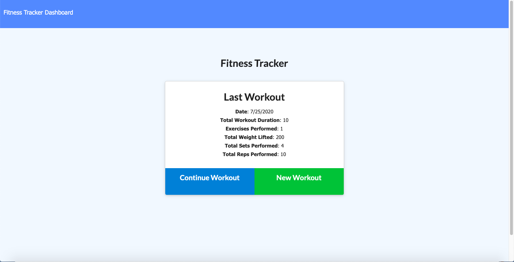

# nosql: Workout Tracker

## Description
This application is a workout tracker where user is able to view, create, and track daily workouts. User can log multiple exercises in a workout on a given day. This application uses Mongo database with a Mongoose schema and handle routes with Express.

## Table of Contents
* [Installation](#installation)
* [Usage](#usage)
* [Credits](#credits)
* [License](#license)
* [Contributing](#contributing)

## Installation
1. Clone the repo
2. Install the packages/dependancies for this app
3. Run node server.js in terminal 

## Usage
[Link to GH Repo](https://github.com/sharonkim09/nosql-workout-tracker)

[Link to Deployed Website](https://serene-caverns-65577.herokuapp.com/)

## Credits
The front end was already provided by the curriculum team. The instructions were provided to me by GT Full Stack Coding Program.

## License
MIT License

Copyright (c) [2020] [Sharon Kim]

Permission is hereby granted, free of charge, to any person obtaining a copy
of this software and associated documentation files (the "Software"), to deal
in the Software without restriction, including without limitation the rights
to use, copy, modify, merge, publish, distribute, sublicense, and/or sell
copies of the Software, and to permit persons to whom the Software is
furnished to do so, subject to the following conditions:

The above copyright notice and this permission notice shall be included in all
copies or substantial portions of the Software.

THE SOFTWARE IS PROVIDED "AS IS", WITHOUT WARRANTY OF ANY KIND, EXPRESS OR
IMPLIED, INCLUDING BUT NOT LIMITED TO THE WARRANTIES OF MERCHANTABILITY,
FITNESS FOR A PARTICULAR PURPOSE AND NONINFRINGEMENT. IN NO EVENT SHALL THE
AUTHORS OR COPYRIGHT HOLDERS BE LIABLE FOR ANY CLAIM, DAMAGES OR OTHER
LIABILITY, WHETHER IN AN ACTION OF CONTRACT, TORT OR OTHERWISE, ARISING FROM,
OUT OF OR IN CONNECTION WITH THE SOFTWARE OR THE USE OR OTHER DEALINGS IN THE
SOFTWARE.

---

## Contributing

We are not currently accepting contributors at the moment.